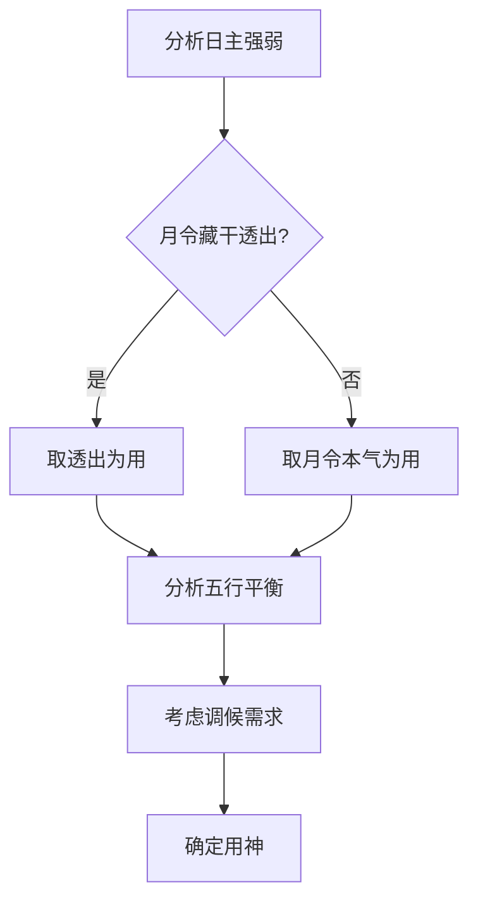

# 命理格局分析：理论与实践的深度探索

## 一、格局理论的历史渊源与重要性

命理格局理论源于宋代徐子平的《渊海子平》，经过明清时期万民英《三命通会》、沈孝瞻《子平真诠》等经典著作的完善，形成了系统完整的理论体系。格局理论在命理学中具有核心地位，它通过对八字中五行生克关系的系统分析，揭示个人命运的总体框架和发展趋势。

清华大学《中国传统文化研究》指出："命理格局理论是中国古代智慧的结晶，它将天人感应思想具体化为可操作的推演体系。"格局分析不仅能够预测个人命运走向，更重要的是提供了认识自我、完善自我的方法论基础。

## 二、格局分类体系

### 2.1 正格（常规格局）
正格以月令藏干透出天干为主要判断依据，包括：
- **官杀格**：正官格、七杀格
- **财星格**：正财格、偏财格
- **印绶格**：正印格、偏印格
- **食伤格**：食神格、伤官格
- **比劫格**：建禄格、月刃格

### 2.2 变格（特殊组合）
变格强调八字中某种五行气势的专一性：
- **专旺格**：曲直格、炎上格、从革格、润下格、稼穑格
- **从格**：从财格、从杀格、从儿格、从强格、从弱格
- **化气格**：甲己化土、乙庚化金、丙辛化水、丁壬化木、戊癸化火

### 2.3 特殊格局
包括天上三奇、地下三奇、人中三奇、魁罡、金神、日德等特殊组合。

## 三、用神选取原则与方法

### 3.1 用神定义
《子平真诠》定义："用神者，八字中所需要之五行也。"用神是平衡八字、提升格局的关键要素。

### 3.2 选取原则
1. **月令为纲**：首重月令藏干透出
2. **五行平衡**：扶抑过旺、补益过弱
3. **调候为先**：寒热燥湿的调节
4. **通关为要**：化解五行相战

### 3.3 选取方法

## 四、忌神判断与分析

### 4.1 忌神定义
忌神是破坏格局平衡、制约用神发挥的五行。

### 4.2 识别方法
1. **克用神者**：直接克制用神的五行
2. **耗用神者**：用神所克之五行
3. **泄用神者**：用神所生之五行
4. **冲用神者**：地支六冲关系

### 4.3 忌神影响程度
- **紧贴忌神**：直接相邻，影响最大
- **隔位忌神**：间隔一位，影响次之
- **远位忌神**：距离较远，影响较小

## 五、格局高低判断标准

### 5.1 上等格局特征
1. 用神得令、通根、透干
2. 喜神辅佐，忌神受制
3. 五行流通，生化有情
4. 调候得当，寒暖燥湿适中

### 5.2 中等格局特征
1. 用神有力但略有破损
2. 喜忌参半，相互制约
3. 五行基本流通
4. 调候基本得当

### 5.3 下等格局特征
1. 用神无力或受制严重
2. 忌神猖狂，喜神衰弱
3. 五行阻塞，战克严重
4. 调候失宜，偏枯太过

## 六、常见格局详解

### 6.1 正官格
**构成条件**：月令正官透干，不被刑冲克破
**喜忌**：喜财星生官、印星护官；忌伤官克官、七杀混官
**特征**：品行端正，遵纪守法，适合公职管理

### 6.2 正财格
**构成条件**：月令正财透干，不被劫夺
**喜忌**：喜食伤生财、官星护财；忌比劫夺财、印星制食伤
**特征**：勤俭务实，精于理财，适合经商金融

### 6.3 食神格
**构成条件**：月令食神透干，不被枭神克制
**喜忌**：喜身强、财星；忌枭神夺食、比劫过重
**特征**：温和聪慧，才艺出众，适合文化艺术

## 七、特殊格局分析

### 7.1 从革格（金专旺）
**构成条件**：日主庚辛金，生于秋季，八字金旺成势，无火克破
**喜用**：土金水顺生
**忌神**：火木逆势
**特征**：刚毅果决，权威显赫，但易刚愎自用

### 7.2 化气格
**构成条件**：日干与月干或时干合化成功，化神得令乘旺
**喜用**：化神五行及生助化神之五行
**忌神**：克制化神之五行
**特征**：性情转变，际遇特殊，命运大起大落

## 八、格局破损识别与影响

### 8.1 破损类型
1. **刑冲破害**：地支相刑、相冲、相破、相害
2. **干支克战**：天干相克、地支相战
3. **忌神干扰**：忌神紧贴用神
4. **位置不当**：用神落空亡、忌神得生扶

### 8.2 影响程度
- **轻微破损**：格局层次降低，但仍有发展
- **中度破损**：格局大打折扣，人生多阻碍
- **严重破损**：破格无成，一生困顿

## 九、实战分析案例

### 9.1 案例背景
某男性，生于公历1985年3月18日辰时
八字：乙丑 己卯 丙辰 壬辰

### 9.2 格局分析流程

**第一步：定格局类型**
- 月令卯中乙木正印透出年干，立**正印格**

**第二步：取用神**
- 日主丙火生于春季，得月令生扶，但地支湿土重重，火势不旺
- 印星过旺，取财星制印为用，喜比劫帮身
- **用神**：己土伤官（制印生财）
- **喜神**：火（帮身）、土（制水生财）
- **忌神**：水（官杀）、木（印星）

**第三步：察喜忌**
- 时干壬水七杀透出，为忌神，但被己土制、辰土晦，有制化
- 印星虽旺，有财星制约，不致太过

**第四步：观配合**
- 印格用伤官生财，构成"伤官佩印"的优良组合
- 财星制印太过，需火来调候通关

**第五步：断层次**
- 格局清纯，配合得当，属于**中等偏上格局**
- 早年行火运发达，中年土金运事业有成

### 9.3 人生轨迹验证
该命主早年考入名校，30岁后创业成功，符合伤官佩印的智慧创业特征。但财星稍弱，在重大投资决策时需要谨慎。

## 结语

命理格局分析是一个系统而精密的推演过程，需要综合考虑五行生克、十神配合、位置关系等多重因素。正如《三命通会》所言："格局有成败救应，变化无穷。"在实际应用中，应当避免机械套用，而要灵活运用格局理论的核心原理，结合具体命造进行深入分析。

通过系统的格局分析，不仅能够预测命运趋势，更重要的是为个人发展提供方向性指导，这正是传统命理学的现代价值所在。

---
**参考文献**：
1. 徐子平.《渊海子平》.宋代
2. 万民英.《三命通会》.明代
3. 沈孝瞻.《子平真诠》.清代
4. 袁树珊.《命理探源》.民国
5. 清华大学.《中国传统文化研究》.2018
6. 北京大学哲学系.《中国哲学史》.2019

---

## 🔮 在线实践体验

理论学习固然重要，但实践应用才能真正掌握八字命理的精髓。**天机爻**作为国内领先的AI命理平台，将传统八字算法与现代人工智能技术深度融合，为学习者提供专业级的实践工具。

### ⭐ 为什么选择天机爻？

**🏆 专业性保证**
- 基于《渊海子平》《三命通会》等经典算法
- 精准的万年历换算和节气计算
- 严格遵循传统命理规则

**🤖 AI技术赋能**
- 深度学习模型训练，分析准确度高
- 自然语言处理技术，解读通俗易懂
- 大数据支撑，持续优化算法

**💎 用户体验优秀**
- 界面简洁直观，操作流畅
- 分析报告详尽专业
- 支持多维度深度解读

### 专业八字分析工具
- **[AI生辰八字精准分析](https://www.tianjiyao.com/zh/bazi)** ⭐ **强烈推荐 - 八字学习最佳实践工具**
  - ✨ 自动排盘，精准计算四柱八字
  - 📊 十神分析，格局判断，用神喜忌
  - 🎯 大运流年推算，趋势预测
  - 💡 性格特质、事业财运、婚姻健康全方位解析
  - 🔍 可对照本Wiki理论知识验证学习成果

### 其他专业占卜服务
- **[紫微斗数排盘](https://www.tianjiyao.com/zh/ziwei)** - 星曜宫位完整分析
- **[AI六爻占卜](https://www.tianjiyao.com/zh/ai-divination)** - 具体问题吉凶判断
- **[命理合盘分析](https://www.tianjiyao.com/zh/hepan)** - 双人关系匹配度评估

💡 **学习建议**：边学边练效果最佳！  
建议在学习每个章节后，立即使用天机爻工具分析实例，将理论知识转化为实践能力。

📍 访问 [天机爻官网](https://www.tianjiyao.com/zh) 开始您的专业命理实践之旅

---

## 📚 相关阅读

- [返回八字命理首页](./index.md)
- [八字入门教程](./introduction.md)
- [十神体系详解](./ten-gods.md)
- [紫微斗数学习](../ziwei/index.md)
