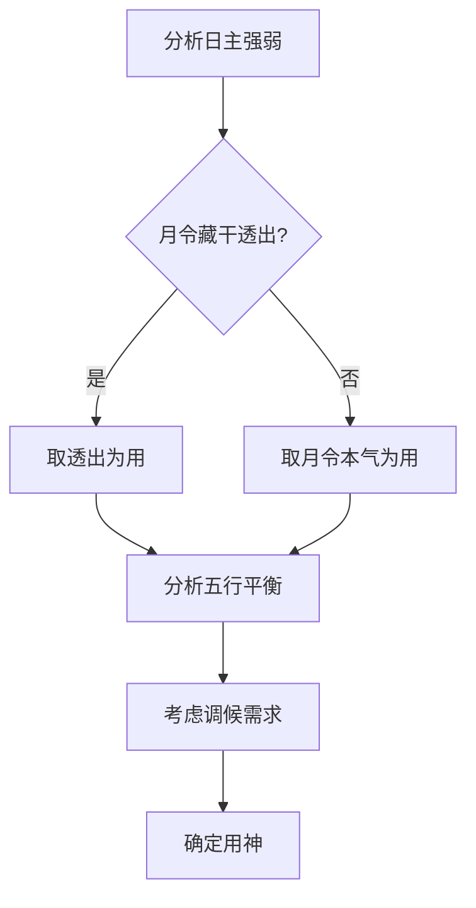

# 八字格局怎么看：八大正格与特殊变格速查表、取格顺序与用神判断全解

> **这篇指南能帮你做什么**：  
> 本文系统整理了**八字核心格局速查总表**、**月令取格三步法定则**、**八大正格吉凶喜忌**、**特殊变格（专旺/从格）判定标准**与**成败救应分析流程**。适合你在完成四柱排盘后，快速定清命局主轴与喜用神走向。

---

## 一、八字核心格局全览速查总表

| 格局类别 | 核心格局名称 | 取格核心条件（以月令为主） | 经典喜神（成格所喜） | 经典忌神（破格所忌） | 命理核心特质与事业成就导向 |
|:---:|:---|:---|:---|:---|:---|
| **正格** | **正官格** | 月令透出正官，身旺能任 | 财星（生官）、印星（护官） | 伤官（克官）、七杀（混杂） | 稳健清正、守规负责，适合体制、行政、大企业管理 |
| **正格** | **七杀格（偏官）** | 月令透出七杀，偏官有制 | 食神（制杀）、正印（化杀） | 财星（滋杀无制）、正官（官杀混杂） | 果敢刚毅、魄力开创，适合军事、法务、创业开疆拓土 |
| **正格** | **正财 / 偏财格** | 月令透出正偏财，日主有根 | 食神伤官（生财）、官星（护财） | 比肩劫财（争财夺财） | 商业嗅觉灵敏、务实求利，适合金融贸易、资产经营 |
| **正格** | **正印 / 偏印格** | 月令透出正印或偏印 | 官杀（生印）、比劫（护印） | 财星（财星坏印破局） | 仁慈宽厚、学识渊博，适合学术科研、文化教育、咨询 |
| **正格** | **食神格** | 月令透出食神，泄秀生财 | 财星（食神生财）、比劫 | 枭神（枭神夺食）、正印（克伤） | 才华横溢、温和宽厚，适合专业技能、餐饮艺术、自由职业 |
| **正格** | **伤官格** | 月令透出伤官，秀气流通 | 正印（伤官配印）、财星（伤官生财） | 正官（伤官见官为祸百端） | 思维敏捷、敢于创新，适合技术攻关、律师演说、设计创意 |
| **变格** | **从格（从财/从杀/从儿）** | 日主无根无气，弱极顺从全局旺神 | 顺从所从之旺神（财/官/食伤） | 印星、比劫（生扶日主导致逆势犯旺） | 极善借势变通、顺应大势，运顺则富贵极品，运逆则波折 |
| **变格** | **专旺格（曲直/从革等）** | 一方五行纯粹专旺，日主极强 | 比劫、印绶、顺泄之食伤 | 强官杀反克（逆其旺势激怒强气） | 志向坚毅、自立自强，成就往往极具突破性与领袖气象 |

---

## 二、格局理论的历史渊源与核心意义

命理格局理论源于宋代徐子平的《渊海子平》，经过明清时期万民英《三命通会》、沈孝瞻《子平真诠》等经典著作的完善，形成了系统完整的理论体系。格局理论在命理学中具有核心地位，它通过对八字中五行生克关系的系统分析，揭示个人命运的总体框架和发展趋势。

清华大学《中国传统文化研究》指出："命理格局理论是中国古代智慧的结晶，它将天人感应思想具体化为可操作的推演体系。"格局分析不仅能够预测个人命运走向，更重要的是提供了认识自我、完善自我的方法论基础。

## 二、格局分类体系

### 2.1 正格（常规格局）
正格以月令藏干透出天干为主要判断依据，包括：
- **官杀格**：正官格、七杀格
- **财星格**：正财格、偏财格
- **印绶格**：正印格、偏印格
- **食伤格**：食神格、伤官格
- **比劫格**：建禄格、月刃格

### 2.2 变格（特殊组合）
变格强调八字中某种五行气势的专一性：
- **专旺格**：曲直格、炎上格、从革格、润下格、稼穑格
- **从格**：从财格、从杀格、从儿格、从强格、从弱格
- **化气格**：甲己化土、乙庚化金、丙辛化水、丁壬化木、戊癸化火

### 2.3 特殊格局
包括天上三奇、地下三奇、人中三奇、魁罡、金神、日德等特殊组合。

## 三、用神选取原则与方法

### 3.1 用神定义
《子平真诠》定义："用神者，八字中所需要之五行也。"用神是平衡八字、提升格局的关键要素。

### 3.2 选取原则
1. **月令为纲**：首重月令藏干透出
2. **五行平衡**：扶抑过旺、补益过弱
3. **调候为先**：寒热燥湿的调节
4. **通关为要**：化解五行相战

### 3.3 选取方法

```mermaid
graph TD
    A[分析日主强弱] --> B{月令藏干透出?}
    B -->|是| C[取透出为用]
    B -->|否| D[取月令本气为用]
    C --> E[分析五行平衡]
    D --> E
    E --> F[考虑调候需求]
    F --> G[确定用神]
```

## 四、忌神判断与分析

### 4.1 忌神定义
忌神是破坏格局平衡、制约用神发挥的五行。

### 4.2 识别方法
1. **克用神者**：直接克制用神的五行
2. **耗用神者**：用神所克之五行
3. **泄用神者**：用神所生之五行
4. **冲用神者**：地支六冲关系

### 4.3 忌神影响程度
- **紧贴忌神**：直接相邻，影响最大
- **隔位忌神**：间隔一位，影响次之
- **远位忌神**：距离较远，影响较小

## 五、格局高低判断标准

### 5.1 上等格局特征
1. 用神得令、通根、透干
2. 喜神辅佐，忌神受制
3. 五行流通，生化有情
4. 调候得当，寒暖燥湿适中

### 5.2 中等格局特征
1. 用神有力但略有破损
2. 喜忌参半，相互制约
3. 五行基本流通
4. 调候基本得当

### 5.3 下等格局特征
1. 用神无力或受制严重
2. 忌神猖狂，喜神衰弱
3. 五行阻塞，战克严重
4. 调候失宜，偏枯太过

## 六、常见格局详解

### 6.1 正官格
**构成条件**：月令正官透干，不被刑冲克破
**喜忌**：喜财星生官、印星护官；忌伤官克官、七杀混官
**特征**：品行端正，遵纪守法，适合公职管理

### 6.2 正财格
**构成条件**：月令正财透干，不被劫夺
**喜忌**：喜食伤生财、官星护财；忌比劫夺财、印星制食伤
**特征**：勤俭务实，精于理财，适合经商金融

### 6.3 食神格
**构成条件**：月令食神透干，不被枭神克制
**喜忌**：喜身强、财星；忌枭神夺食、比劫过重
**特征**：温和聪慧，才艺出众，适合文化艺术

## 七、特殊格局分析

### 7.1 从革格（金专旺）
**构成条件**：日主庚辛金，生于秋季，八字金旺成势，无火克破
**喜用**：土金水顺生
**忌神**：火木逆势
**特征**：刚毅果决，权威显赫，但易刚愎自用

### 7.2 化气格
**构成条件**：日干与月干或时干合化成功，化神得令乘旺
**喜用**：化神五行及生助化神之五行
**忌神**：克制化神之五行
**特征**：性情转变，际遇特殊，命运大起大落

## 八、格局破损识别与影响

### 8.1 破损类型
1. **刑冲破害**：地支相刑、相冲、相破、相害
2. **干支克战**：天干相克、地支相战
3. **忌神干扰**：忌神紧贴用神
4. **位置不当**：用神落空亡、忌神得生扶

### 8.2 影响程度
- **轻微破损**：格局层次降低，但仍有发展
- **中度破损**：格局大打折扣，人生多阻碍
- **严重破损**：破格无成，一生困顿

## 九、实战分析案例

### 9.1 案例背景
某男性，生于公历1985年3月18日辰时
八字：乙丑 己卯 丙辰 壬辰

### 9.2 格局分析流程

**第一步：定格局类型**
- 月令卯中乙木正印透出年干，立**正印格**

**第二步：取用神**
- 日主丙火生于春季，得月令生扶，但地支湿土重重，火势不旺
- 印星过旺，取财星制印为用，喜比劫帮身
- **用神**：己土伤官（制印生财）
- **喜神**：火（帮身）、土（制水生财）
- **忌神**：水（官杀）、木（印星）

**第三步：察喜忌**
- 时干壬水七杀透出，为忌神，但被己土制、辰土晦，有制化
- 印星虽旺，有财星制约，不致太过

**第四步：观配合**
- 印格用伤官生财，构成"伤官佩印"的优良组合
- 财星制印太过，需火来调候通关

**第五步：断层次**
- 格局清纯，配合得当，属于**中等偏上格局**
- 早年行火运发达，中年土金运事业有成

### 9.3 人生轨迹验证
该命主早年考入名校，30岁后创业成功，符合伤官佩印的智慧创业特征。但财星稍弱，在重大投资决策时需要谨慎。

## 结语

命理格局分析是一个系统而精密的推演过程，需要综合考虑五行生克、十神配合、位置关系等多重因素。正如《三命通会》所言："格局有成败救应，变化无穷。"在实际应用中，应当避免机械套用，而要灵活运用格局理论的核心原理，结合具体命造进行深入分析。

通过系统的格局分析，不仅能够预测命运趋势，更重要的是为个人发展提供方向性指导，这正是传统命理学的现代价值所在。

---

## 十、常见问题解答（FAQ）

### Q1：八字“格局”到底是什么意思？为什么看八字先看格局？
**答**：八字格局是整个命盘五行力量的“核心骨架与组织形式”，犹如建筑的主梁。古人以月令提纲为司令主气，看哪个十神主导全局或气聚一方。定清格局才能分清谁是用神、谁是忌神，进而推断一个人的事业高度、成就路径、性格特质与运势成败。

### Q2：八字取格的标准顺序是什么？（怎么确定自己是什么格？）
**答**：取格经典三步法：1. 看月令本气是否透出天干，透出即以本气立格（如寅月透甲木为正印/食神等）；2. 若本气不透，看月令中气或余气哪个透出天干，以透干力强者立格；3. 若藏干均不透，则以月令本气直接立格，再结合原局气势辨析是否成专旺或从格。

### Q3：什么是“八大正格”？最常见的吉利组合有哪些？
**答**：八大正格以十神分类：正官格、七杀格（偏官格）、正财格、偏财格、正印格、偏印格（枭神格）、食神格、伤官格。常见的大贵上等格局包括：官印相生（贵显稳健）、杀印相生（化煞为权）、食神制杀（文武双全）、财旺生官（富贵双全）、伤官配印（聪明掌权）。

### Q4：什么是八字格局的“破格”与“救应”？
**答**：破格指原有良好的格局被破坏（如正官格见伤官克官、正财格见劫财夺财、印绶格见财星破印）；救应指命局有其他字制化破格之凶物（如正官格见伤官，但同时有正印克制伤官护官，称为“伤官见官而有印护”）。有破有救，往往成就更大。

### Q5：八字原局没有明显正格，怎么看是不是“从格”或“专旺格”？
**答**：从格指日主极度衰弱无依（无根无生助），满盘尽是财、杀或食伤，日主不得不顺从最强旺的五行（如从财格、从杀格、从儿格）；专旺格指日主与同类五行极度旺盛，贯通全局（如曲直仁寿木格、炎上火格、润下水格）。变格以“顺其旺势”为喜用，最忌逆势破局。

---

## 🧭 下一步与实践验证

- **适合你在以下场景使用**：  
  当你已经排好生辰八字四柱、需要快速判断自己命盘属于哪类正格或变格、理清喜用神与忌神，或推断未来行运成败时，本页规则提供清晰的判断依据。
- **如果你想直接查看自己的八字格局诊断**：  
  可以前往天机爻主站的 [八字排盘与格局分析工具](https://tianjiyao.com/zh/bazi) 自动测算八字强弱、格局归属与用神喜忌；
- **如果你想进一步学习十神与干支生克**：  
  可以继续阅读 [十神体系深度详解](./ten-gods.md) 与 [干支合冲刑害分析指南](./ganzhi-relations.md)。

---

## 📚 推荐延伸阅读

- [八字入门教程：四柱、五行与干支结构](./introduction.md)
- [八字大运流年怎么看：起运年龄计算与流年吉凶断法速查](./luck-cycles.md)
- [八字用神怎么看：喜用神、喜忌判断与调候通关](./yongshen-tiaohou.md)
- [天机爻 Wiki 首页](../index.md)
